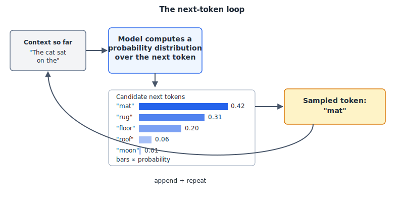

# Chunk 00: What is a Language Model

**Purpose.** Build a correct, load-bearing mental model of what a language model actually is — a learned probability distribution over the next token — before we touch tokenization, transformer architecture, or training.
**Previously.** Nothing. This is the start of the curriculum; there is no prior chunk to bridge from.
**Today.** What "next-token prediction" means, why it's the entire training objective behind every LLM you've used, and why calling that objective "just autocomplete" is simultaneously accurate and deeply misleading.



*Figure 1: Generating one token conditions on everything before it; the chosen token is appended to the context and the loop repeats.*

---

## Beginner

Here's the whole trick, stripped of jargon: a language model is a machine that has read an enormous amount of text and learned, for any string of words you give it, what word is likely to come next.

That's it. That's the core mechanism behind ChatGPT, Claude, and every other chatbot you've used. Given "The capital of France is", the model has seen this pattern (or ones very like it) so many times that it assigns very high odds to "Paris" as the next word, and low odds to "banana." It picks a word (usually a high-probability one), adds it to the text, and then repeats the whole process — now predicting the next word after "The capital of France is Paris." Do that over and over, one word (technically one "token," a chunk of a word — more on that in a later chunk) at a time, and you get a full paragraph, an essay, or working code.

This is genuinely the same basic idea as the autocomplete on your phone keyboard, which suggests the next word as you type. The honest, unglamorous name for what an LLM does is "next-token prediction," and it is fair to call that autocomplete.

But here's where the "just" in "just autocomplete" starts to mislead you. Your phone's autocomplete was trained on a comparatively small, narrow dataset and uses a small model — it can barely finish a sentence coherently. A large language model was trained on a substantial fraction of all human writing available on the internet and books, using a network with billions of internal parameters. To get good at predicting the next word across that much text, in that many contexts, the model had to internalize an enormous amount of structure about the world: grammar, facts, arithmetic, coding conventions, reasoning patterns, tone, and much more. Predicting the next word of a legal contract, a Python script, and a poem all reasonably well requires something well beyond memorizing common phrases.

So the honest summary is: an LLM is "just" predicting the next word, in the same sense that a marathon runner is "just" putting one foot in front of the other. The mechanism is simple. What emerges from doing it at scale is not.

## Practitioner

If you use LLM APIs or chat interfaces regularly, the mental model worth internalizing is this: at every step, the model is not "deciding what to say." It is computing a probability distribution over every possible next token given everything that came before (your prompt, any system instructions, and everything it has generated so far in this response), then a token gets sampled from that distribution, appended to the sequence, and the whole process repeats.

Concretely: suppose you send the prompt "The best way to reverse a string in Python is". Internally, the model doesn't look up "the answer." It computes something like:

```
P(next token | "The best way to reverse a string in Python is") =
  "to"     : 0.41
  "using"  : 0.22
  "with"   : 0.14
  "a"      : 0.09
  ... (thousands of other tokens with tiny probabilities)
```

It samples (or, near-deterministically at low "temperature," just picks the top one) — say "to" — appends it, and now computes a new distribution conditioned on "The best way to reverse a string in Python is to", which might heavily favor "use" next, then "the", then "slicing", then "syntax", and so on until it produces a full, coherent explanation with a code block. There is no separate "understanding module" and "writing module" — the entire response, including code, reasoning steps, and citations, is generated by this same repeated act of predicting one token at a time.

The practical implication: everything you put before the model's next prediction — your system prompt, conversation history, retrieved documents, tool outputs — is the *only* thing the distribution is conditioned on. The model has no side-channel access to "what you meant." If a prompt is ambiguous, the probability mass spreads across several plausible continuations, and the sampled output reflects that ambiguity. This is why specific, well-structured prompts produce more reliable results: you are literally reshaping the probability distribution the model draws its next token from. It's also why models can be "surprised" mid-generation into an inconsistent answer — each token is chosen based on the tokens so far, so an early wrong turn (a bad first sentence, a hallucinated fact) shifts every subsequent probability distribution, making the model more likely to continue in that same wrong direction. This is the mechanistic reason "let's think step by step" and structured prompts work: forcing intermediate tokens onto the page changes what the *next* prediction is conditioned on.

## Expert

Formally, an autoregressive language model defines a probability distribution over a sequence of tokens $x_1, \dots, x_T$ via the chain rule of probability:

$$P(x_1, \dots, x_T) = \prod_{t=1}^{T} P(x_t \mid x_1, \dots, x_{t-1})$$

Training consists of maximizing the likelihood of observed text under this factorization — equivalently, minimizing the cross-entropy (negative log-likelihood) between the model's predicted next-token distribution and the actual next token, averaged over a massive training corpus. This is the same objective, essentially unchanged in form, from Bengio et al.'s original neural formulation through to today's largest models: learn $P(x_t \mid x_{<t})$ as a parametric function and fit it by maximum likelihood (Bengio et al., 2003).

Bengio et al. (2003) introduced the now-standard approach of learning a distributed vector representation for each word jointly with the next-word probability function, explicitly to fight the curse of dimensionality that plagued earlier n-gram models — the same curse Shannon's n-gram-based entropy estimates of English ran into decades earlier (Shannon, 1948; 1951). Radford et al. (2018) showed that a Transformer decoder trained with exactly this generative, autoregressive objective on unlabeled text, then lightly fine-tuned, transferred well to a wide range of downstream language tasks — the first clear demonstration that large-scale generative pretraining alone captured task-general linguistic competence. Brown et al. (2020) then showed that scaling the same architecture and objective to 175B parameters (GPT-3) produced strong few-shot and zero-shot task performance from nothing but next-token prediction on raw text, with no task-specific fine-tuning or architecture changes at all — arguably the strongest empirical case that this one simple objective, scaled up, is sufficient to produce broad competence.

This raises the open question this curriculum will return to repeatedly: does next-token prediction alone explain the more surprising capabilities attributed to LLMs — multi-step reasoning, tool use, in-context learning — or are these better understood as an artifact of scale and evaluation choices rather than a qualitatively new capability? Wei et al. (2022) documented "emergent abilities" that appear discontinuously as models scale, framing them as qualitatively new. Schaeffer, Miranda, and Koyejo (2023) pushed back, arguing that many apparent emergent jumps are a consequence of using discontinuous evaluation metrics, and that performance is often smooth and predictable on continuous metrics. Practitioners should hold both views loosely: the training objective is simple and fully specified by the equation above, but *what* function best predicts real text turns out, empirically, to require internalizing structure (syntax, world knowledge, multi-step inference patterns) far beyond naive word-frequency statistics — the actual mechanism connecting "predict the next token" to "can follow a multi-step coding instruction" is still an active research question, not settled science.

---

## Implications for agentic-dev

When you write a prompt, a `CLAUDE.md` file, or a system instruction in Claude Code, you are not "configuring a program" in the traditional sense — you are supplying the conditioning context, i.e. the $x_1, \dots, x_{t-1}$ in the formula above, that shapes every subsequent token's probability distribution. This is the actual mechanistic reason prompting works at all: there is no separate "instruction interpreter" module distinct from the token predictor. The instructions you give *are* part of the sequence the model conditions on when it predicts what comes next, exactly like any other preceding text.

This explains several things you'll observe using Claude Code directly:

- **Why detailed, explicit instructions in `CLAUDE.md` or system prompts change behavior reliably.** They aren't parsed into some separate rule engine; they shift the probability mass of every following token toward continuations consistent with them, the same way any preceding text would.
- **Why multi-step reasoning and plan mode help.** Forcing the model to emit intermediate tokens — a plan, a list of steps, a scratchpad — before the final action means those intermediate tokens become part of the context that conditions the next prediction. The model isn't consulting a hidden reasoning module before deciding what to write; committing the reasoning to tokens *is* what makes it available to condition on for the next step. This is why asking Claude Code to "make a plan first" tends to produce more reliable multi-step edits than asking for the end result directly: it's not persuasion, it's changing what the next-token distribution is computed from.
- **Why order and recency in context matter.** Tokens further back in a long conversation still condition every prediction, but instructions placed clearly and close to the relevant point in context tend to shape completions more reliably than ones buried early and far away — a direct consequence of how the conditioning sequence is used, not a quirk of "attention span."
- **Why the model can be steered but not truly "instructed" in the way software is configured.** An instruction is a strong nudge to the probability distribution, not a guaranteed constraint — which is exactly why agentic tools like Claude Code layer deterministic guardrails (permission prompts, sandboxing, hooks, tool schemas) on top of the model rather than relying on prompted instructions alone for safety-critical behavior.

Understanding this now will make the later chunks on tokenization, context windows, and training click faster — they are all elaborations on the mechanism introduced here.

---

## Checklist

- [ ] I can state, in one sentence, what a language model computes at each step (a probability distribution over the next token, given everything before it).
- [ ] I can explain why "it's just autocomplete" is technically correct but misleading, and give one reason why (scale of data/parameters produces capabilities beyond simple pattern completion).
- [ ] I can describe, in my own words, the autoregressive generation loop: predict a distribution, sample/select a token, append it, repeat.
- [ ] I understand that a prompt, system instruction, or `CLAUDE.md` file works by becoming part of the conditioning context — not by being "executed" as a separate instruction set.
- [ ] I can name at least one paper that first demonstrated generative pretraining transfers well to downstream tasks (GPT-1) and one that showed scaling this objective produces few-shot competence (GPT-3).
- [ ] I can state the open question about whether next-token prediction alone explains emergent reasoning-like behavior, and that this is genuinely debated, not settled.

## References

1. "A Neural Probabilistic Language Model" — Bengio, Ducharme, Vincent, Jauvin, *Journal of Machine Learning Research* 3 (2003), pp. 1137–1155. https://www.jmlr.org/papers/v3/bengio03a.html
2. "Improving Language Understanding by Generative Pre-Training" — Radford, Narasimhan, Salimans, Sutskever, OpenAI Technical Report (2018). https://cdn.openai.com/research-covers/language-unsupervised/language_understanding_paper.pdf
3. "Language Models are Few-Shot Learners" — Brown et al., *NeurIPS* 2020. arXiv:2005.14165. https://arxiv.org/abs/2005.14165
4. "A Mathematical Theory of Communication" — Shannon, *Bell System Technical Journal*, 27 (1948), pp. 379–423, 623–656. https://en.wikipedia.org/wiki/A_Mathematical_Theory_of_Communication (original scans widely mirrored, e.g. Bell Labs archives)
5. "Prediction and Entropy of Printed English" — Shannon, *Bell System Technical Journal*, 30 (1951), pp. 50–64. DOI: 10.1002/j.1538-7305.1951.tb01366.x
6. "Are Emergent Abilities of Large Language Models a Mirage?" — Schaeffer, Miranda, Koyejo, 2023. arXiv:2304.15004. https://arxiv.org/abs/2304.15004 (companion open-question source: "Emergent Abilities of Large Language Models" — Wei et al., 2022, arXiv:2206.07682, https://arxiv.org/abs/2206.07682)

## Chunk summary

A language model is, mechanically, nothing more than a learned function that predicts the next token given everything before it — trained by maximizing the likelihood of real text, a lineage running from Bengio's 2003 neural formulation through GPT-1's demonstration that this objective transfers to real tasks, to GPT-3's demonstration that scaling it produces broad few-shot competence. "Just autocomplete" is accurate about the mechanism and misleading about the consequence, since the same simple objective, at scale, appears to internalize far more structure than word-frequency statistics — a point still actively debated among researchers. For anyone using Claude Code, this is not academic: every prompt, `CLAUDE.md` instruction, and planning step works precisely because it becomes part of the context the next token is conditioned on, which is the entire causal mechanism behind why prompting and structured multi-step instructions influence the model's behavior at all.
