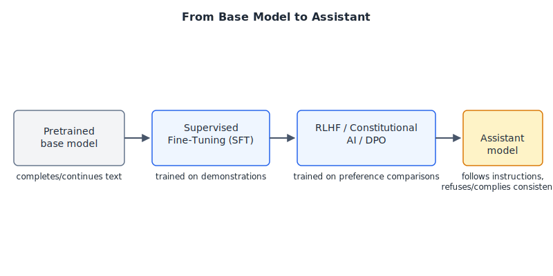

# Chunk 04: From Base Model to Assistant

**Purpose.** Explain the post-training pipeline — SFT, RLHF, Constitutional AI, and DPO — that turns a raw next-token predictor into a chat assistant with instruction-following behavior and a consistent "personality."
**Previously.** Chunk 03 covered pretraining and scaling laws: how a base model learns to predict text from massive raw corpora.
**Today.** How that base model gets adapted — through demonstration data, human/AI feedback, and preference optimization — into something like ChatGPT or Claude.

*Figure 1: Each post-training stage changes what the model optimizes for — from "continue this text plausibly" to "follow this instruction the way a helpful, consistent assistant would."*

---

## Beginner

Imagine you gave someone a machine that has read almost everything ever written, and its only skill is: given some text, predict what word comes next. That's a **base model**. Ask it "What's the capital of France?" and it might not answer you — it might continue the sentence as if it were a quiz worksheet, adding "What's the capital of Germany?" right after, because that's a plausible continuation of text that looks like a list of quiz questions. The base model isn't trying to help you. It's trying to guess what text comes next, and "answer the question" is just one of many equally plausible continuations.

To turn that into an assistant, developers run a few extra training stages, collectively called **post-training** or **alignment**.

First comes **supervised fine-tuning (SFT)**: humans write out example conversations — a question, and the ideal answer — and the model is trained to imitate that pattern. This is the model's first lesson in "oh, this is a Q&A format, and I should behave like the helpful person answering, not the person asking."

Second comes **learning from feedback**. Humans (or, increasingly, AI systems following written guidelines) compare pairs of model answers and say which one is better. The model uses this feedback signal to get better at producing answers people actually prefer — clearer, safer, more honest, more useful. Two techniques you'll hear about here are **RLHF** (reinforcement learning from human feedback) and **Constitutional AI** (using a written set of principles and AI-generated critiques instead of relying purely on human raters for every judgment). A newer, simpler technique called **DPO** achieves a similar effect with less machinery.

The result of all this is a **chat/assistant model**: something that answers instead of merely continuing, refuses harmful requests, admits uncertainty, and has a recognizable, consistent voice. None of that comes from pretraining alone — it comes from this second training phase, deliberately shaping the model's behavior on top of its raw knowledge.

## Practitioner

If you've ever wondered why a "base model" API endpoint feels weirdly useless — rambling, completing your prompt instead of answering it, sometimes generating both sides of a conversation — that's because base models have no notion of "this is a request, respond to it." They've only ever learned "text tends to continue this way." Post-training is what installs the request-response structure, the refusal behavior, and the tone.

**Mental model:** think of the base model as raw material — extremely knowledgeable but with no sense of role. Post-training doesn't add new facts (mostly); it reshapes the *distribution over behaviors* the model expresses. It teaches the model which persona to adopt (helpful assistant, not random internet author), which response shape to default to (answer directly, then elaborate), and where the lines are (refuse this, comply with that, ask for clarification here).

**Concrete worked example.** Prompt: "How do I pick a lock?"
- A **base model**, having seen this string in forums, fiction, and locksmith manuals alike, might continue with anything: a story snippet, a technical breakdown, a joke, or another unrelated question — whatever is statistically likely to follow that string in its training data, with no regard for who's asking or why.
- A **post-trained assistant model** has been shaped, via SFT examples and preference feedback, to recognize this as a request with dual-use potential. It will typically give a measured, legitimate answer (e.g., explaining lock mechanisms for a locksmithing hobbyist context) rather than either stonewalling or giving a no-context "how-to" — because during RLHF/Constitutional AI training, raters or AI-feedback rules rewarded exactly that kind of calibrated response over both extremes.

That's the practical difference: a base model has *capability* without *judgment about when/how to deploy it in a conversation*; the assistant model has been optimized specifically for conversational judgment — refuse, comply, hedge, or ask a clarifying question, depending on stakes and ambiguity.

Why does the model "have a personality" at all? Because the demonstration data in SFT and the preference comparisons in RLHF/DPO are not random — they consistently reward a particular tone (e.g., warm but direct, hedging under uncertainty, avoiding sycophancy). Consistency in training signal produces consistency in output style. This is also why different labs' assistants "feel" different from each other despite comparable base-model capability — the taste and values baked into their SFT data and reward models differ.

One practical implication: when you see a model refuse something it's clearly *capable* of doing (the underlying knowledge is there), that's a post-training decision, not a capability gap. Jailbreaks often work by finding prompts that push the model back toward base-model-like completion behavior, bypassing the assistant persona's guardrails.

## Expert

**Supervised fine-tuning (SFT)** is the first post-training stage: the pretrained model is fine-tuned via standard next-token-prediction loss on a curated dataset of (prompt, high-quality response) pairs, typically written or selected by human labelers. This teaches format and style — question-answering, instruction-following, dialogue turns — but is data-limited: it scales only as fast as humans can write good demonstrations, and it can't easily encode fine-grained preferences ("this answer is better than that one" is hard to express as a single demonstration).

**RLHF** (Christiano et al., 2017, "Deep Reinforcement Learning from Human Preferences," introduced the general preference-learning-plus-RL recipe outside of language) was adapted for instruction-following LLMs by Ouyang et al. (2022, "Training language models to follow instructions with human feedback," the InstructGPT paper). The pipeline: (1) SFT on demonstrations; (2) collect human rankings over sampled model outputs and train a **reward model** to predict these preferences; (3) fine-tune the SFT model with **PPO** (proximal policy optimization) to maximize the learned reward, typically with a KL-divergence penalty against the SFT policy to prevent the policy from drifting too far and "reward hacking" the model. Ouyang et al. found a 1.3B-parameter InstructGPT model was preferred by human raters over the 175B-parameter base GPT-3, despite the enormous capability gap — evidence that alignment quality and raw scale are separate axes.

**Constitutional AI** (Bai et al., 2022, "Constitutional AI: Harmlessness from AI Feedback," Anthropic) reduces reliance on human labels for harmlessness by substituting AI feedback governed by a written set of principles (a "constitution") for much of the human ranking step. It has two phases: a supervised phase where the model critiques and revises its own outputs against the constitution and is fine-tuned on the revisions; and an RL phase ("RLAIF") where an AI preference model — trained on AI-generated comparisons rather than human ones — supplies the reward signal in place of (or alongside) a human-trained reward model. This makes the values steering the model auditable (they're written down) and reduces the human-labeling bottleneck, at the cost of depending on the base model's ability to self-critique faithfully.

**DPO** (Rafailov et al., 2023, "Direct Preference Optimization: Your Language Model is Secretly a Reward Model," NeurIPS) observes that the RLHF objective (KL-regularized reward maximization) has a closed-form optimal policy in terms of the reward function. Substituting this back into the Bradley-Terry preference model yields a loss expressed purely in terms of the policy's own log-probabilities on chosen vs. rejected completions relative to a frozen reference model — no explicit reward model, no PPO rollout, no RL loop at all. DPO turns preference alignment into a supervised classification-style objective, which is why it has become popular for its simplicity and stability relative to PPO-based RLHF, though practitioners still debate whether it matches RLHF's ceiling on harder alignment tasks.

**Open questions:** (1) *Reward hacking / Goodhart's law* — a learned reward model is an imperfect proxy for "what humans actually want," and optimizing hard against it (via PPO or DPO) can exploit proxy weaknesses rather than genuinely improving quality; KL penalties and iterative re-labeling mitigate but don't eliminate this. (2) *Alignment tax and capability vs. behavior* — it remains an open empirical question, discussed since Ouyang et al., how much RLHF/DPO genuinely improves the model's judgment versus merely reshaping surface-level style and refusal patterns while leaving underlying capabilities (and their failure modes) largely intact.

---

## Implications for agentic-dev

Everything in agentic-dev's prompting guidance (chunk 02, "task and tone") is downstream of this post-training process. Concretely:

- **Why tone-context instructions work at all.** Agentic-dev's chunk 02 shows that Claude, left without explicit tone guidance, "fills gaps with plausible invention" — and prescribes rules like calibrating confidence to evidence and naming ambiguities instead of smoothing them over. This only makes sense because SFT and RLHF/Constitutional AI trained the model to have a *default* conversational stance (helpful, fluent, fills gaps to sound complete) that can be steered but has to be explicitly overridden for high-stakes, evidence-bound tasks. A base model wouldn't have a "default stance" to override in the first place — it would just continue text however seemed statistically likely, with no coherent persona to instruct.
- **Why the model answers instead of completing.** A raw base model given "Analyze the form's 17 checkboxes for Vehicle A and Vehicle B" (agentic-dev's example of a well-specified task) has no guarantee of producing an analysis — it might continue the prompt as if it were part of a larger document. The assistant model reliably interprets this as a request and responds to it because SFT demonstration data consistently paired instruction-shaped prompts with direct, on-task answers, and RLHF/DPO reinforced that pattern over meandering completions.
- **Refusals and permission-asking as trained behavior, not hardcoded rules.** Claude's tendency to ask before risky or destructive actions (e.g., before deleting files or running an irreversible command) is a behavior instilled the same way as everything else in this chunk: through demonstration data and preference comparisons (human and Constitutional-AI-style) that consistently rewarded pausing-and-confirming over silently proceeding in ambiguous, high-stakes situations. It is a learned disposition shaped in post-training, not a separate rule-based filter bolted on afterward — which is exactly why it can be described, invoked, and reasoned about in natural-language prompting guidance rather than only in code.
- **Consistent voice across a long agentic session.** Agentic-dev's emphasis on tone rules (factual, evidence-proportional confidence, explicit about ambiguity) is only stable advice because RLHF/DPO optimizes for a consistent style across many outputs, not a one-off response. That consistency is what lets a prompting guide say "set this tone once" and expect it to hold across a session, rather than needing to re-establish persona on every single turn.

---

## Checklist

- [ ] I can explain why a base model "completes" a prompt instead of "answering" it.
- [ ] I can name the three stages of the InstructGPT RLHF pipeline: SFT, reward model, PPO.
- [ ] I can explain what Constitutional AI replaces human labels with, and why that matters for scalability.
- [ ] I can state, at a high level, how DPO avoids training a separate reward model and running RL.
- [ ] I can give one concrete example where a base model and an assistant model would behave differently on the same prompt.
- [ ] I can connect Claude's refusal/permission-asking behavior to post-training rather than a hardcoded filter.
- [ ] I can articulate at least one open question about whether RLHF changes capability or just surface behavior.

## References

1. Training language models to follow instructions with human feedback (Ouyang, Wu, Jiang, Almeida, Wainwright, et al., 2022, OpenAI / arXiv:2203.02155) — https://arxiv.org/abs/2203.02155
2. Deep reinforcement learning from human preferences (Christiano, Leike, Brown, Martic, Legg, Amodei, NeurIPS 2017 / arXiv:1706.03741) — https://arxiv.org/abs/1706.03741
3. Constitutional AI: Harmlessness from AI Feedback (Bai, Kadavath, Kundu, Askell, et al., 2022, Anthropic / arXiv:2212.08073) — https://arxiv.org/abs/2212.08073
4. Direct Preference Optimization: Your Language Model is Secretly a Reward Model (Rafailov, Sharma, Mitchell, Ermon, Manning, Finn, NeurIPS 2023 / arXiv:2305.18290) — https://arxiv.org/abs/2305.18290

## Chunk summary

A base model only predicts plausible next text; post-training — SFT on demonstrations, then preference learning via RLHF (Ouyang et al., building on Christiano et al.'s preference-learning framework), Constitutional AI (Bai et al.), or the RL-free alternative DPO (Rafailov et al.) — is what turns it into an assistant that answers, refuses, hedges, and holds a consistent tone. Every piece of agentic-dev's tone/behavior prompting guidance, and behaviors like Claude asking permission before risky actions, is instructing a disposition that post-training installed, not code that pretraining produced or that sits outside the model as a separate rule layer.
