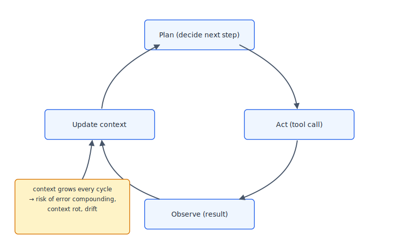

# Chunk 10: Agents — Putting It Together

**Purpose.** Synthesize the entire curriculum into a single picture: an "agent" is not a new kind of model, it's an LLM wrapped in a loop, repeatedly deciding what to do next — and every mechanism from chunks 00-09 shapes how that loop succeeds or fails.
**Previously.** Chunk 09 covered retrieval-augmented generation and tool use — giving a model the ability to look things up or take actions outside its own weights.
**Today.** We cover the agent loop itself (plan, act, observe, repeat), planning/decomposition strategies, memory across steps, self-correction, how to evaluate agents, and the specific failure modes — error compounding, context rot, and drift — that only appear once you chain many LLM calls together. This is the capstone chunk: it doesn't introduce new mechanisms so much as show how the mechanisms from every prior chunk interact and amplify each other over many steps.



*Figure 1: The agent loop — every mechanism from earlier chunks (tokenization cost, attention limits, alignment, in-context learning, context windows, decoding, hallucination, tool use) reappears here, now repeating and compounding every cycle.*

---

## Beginner

Everything so far in this curriculum has been about a single exchange: you say something, the model says something back. An **agent** is what you get when you stop stopping after one exchange — instead, the model keeps going in a loop: look at the current situation, decide on one small step, actually do that step (like running a search, editing a file, or calling some tool), look at what happened, and decide on the next step. It repeats this over and over until the task is done or it gives up.

A useful analogy: think of a new employee working through a to-do list on a project they've never done before. They don't get the whole plan handed to them perfectly in advance. They look at where things stand, do one task, check whether it actually worked, update their notes, and figure out the next task from there. Most of the time this works fine. But a few things can go wrong that don't show up if you just watch them do one task in isolation.

First, **small mistakes compound**. If the employee misreads a memo in step 2, and step 5 depends on step 2 being right, the step 5 mistake doesn't look like a fresh error — it looks like a natural continuation of a plan that was already quietly broken. Second, **notes get messy over a long project**. As their to-do list and notebook fill up with everything that's happened so far, it gets harder for them to tell which older notes still matter and which are now irrelevant clutter — they start losing track of the original goal underneath the pile of intermediate steps. Third, **they can drift**. Twenty steps in, the task they're doing might have subtly wandered away from what was actually asked, without any single step feeling like a wrong turn.

An LLM-based agent has all three of these tendencies, for reasons that trace directly back to how these models work: it generates one token at a time with no built-in "undo," it can only "remember" what fits in its context window, and its confidence in its own output doesn't reliably track whether that output is actually correct. None of this makes agents useless — it just means using one well requires understanding these mechanisms, not just trusting the loop to sort itself out.

## Practitioner

The core reason agents fail differently than single-turn chat is that **a single-turn error is a one-time cost, but a multi-step error is a compounding one.** In a normal chat, if the model hallucinates or misreads your intent, you see it immediately and correct it. In an agent loop, that same error gets written into the context, treated as "established fact" by every subsequent step, and can silently steer twenty more steps in the wrong direction before anyone notices — because each individual step, viewed on its own, looks locally reasonable.

Three failure modes matter in practice:

- **Error compounding.** A wrong assumption made at step 3 doesn't disappear; it becomes part of the context every later step conditions on. If step 3 says "the config file is at `src/config.json`" and that's wrong, every later step that tries to read or write that path inherits the error, and the agent may even fabricate plausible-looking justifications for why the (wrong) path makes sense — this is hallucination (chunk 08) interacting with the loop structure.
- **Context rot.** As the transcript grows — every tool call, every file read, every intermediate result gets appended to context — signal gets diluted by accumulated noise. Chroma's 2025 research on this ("Context Rot: How Increasing Input Tokens Impacts LLM Performance") tested 18 frontier models and found performance is *not* flat across the context window: it degrades unevenly as input grows, even well within the advertised context limit, and degrades faster when the relevant information competes with lots of irrelevant accumulated text. This is chunk 06's "lost in the middle" problem, but it gets worse specifically because agent loops are what generates the giant, noisy context in the first place.
- **Drift / losing the plot.** Over a long session, the working goal can slowly shift away from the original ask as the agent responds to whatever the last few tool outputs said, rather than re-grounding in the original instruction. Nothing "breaks" at any single step; the sum of many small directional nudges adds up.

A concrete (composite, illustrative) trace of how this typically unfolds:

```
Step 1:  Task: "Fix the failing test in payment_test.py"
Step 4:  Agent reads payment_test.py, misidentifies the failure as a
         timezone bug (it's actually a rounding bug)
Step 7:  Agent edits timezone handling code — test still fails
Step 9:  Agent, now with a long context full of timezone-related edits,
         "reasons" that the timezone fix must be incomplete and
         broadens the edit to unrelated date-handling code
Step 14: Original test still fails; two unrelated files have now
         been modified based on a wrong premise from step 4
```

No single step "hallucinated" wildly — each was a locally sensible continuation of what came before. The failure lives in the accumulation, not in any one step.

Practical safeguards that actually help: **checkpoints** (stop and have a human or a separate check confirm progress before continuing, rather than running 20 steps unsupervised); **explicit re-grounding** (periodically re-state the original goal into context rather than trusting it survived 15 steps of accumulated tool output); **narrow, verifiable steps** (prefer steps with checkable outcomes — tests passing, diffs reviewable — over steps that only "sound" right); **context pruning** (actively drop or summarize stale tool output instead of letting the transcript grow unbounded); and **fresh sub-contexts for sub-tasks** (spin up a clean context for a bounded piece of work instead of doing everything in one ever-growing session — see subagents, below).

## Expert

Formally, an LLM agent is a policy `π(a_t | c_t)` where `c_t` is the accumulated context at step `t` (system prompt, task, prior actions, prior observations) and `a_t` is the next action — which may be a tool call, a piece of reasoning, or a final answer. After acting, the environment (a tool, a file system, a user) returns an observation `o_t`, and `c_{t+1} = c_t ⊕ a_t ⊕ o_t`. This is exactly the ReAct loop (Yao et al., 2022, covered in chunk 09): reasoning traces and actions are interleaved, each conditioning the next. The entire loop inherits, and repeatedly re-applies, every mechanism from earlier chunks: autoregressive generation (chunk 00) with no ability to revise earlier tokens once emitted; a context window that is finite and where attention degrades unevenly across position and length (chunks 02, 06); decoding that is stochastic unless deliberately constrained (chunk 07); and a base rate of hallucination/miscalibration that does not go to zero just because the model is "reasoning" (chunk 08).

**Planning and decomposition.** Rather than emitting one flat action sequence, more capable agent architectures separate planning from execution — maintaining an explicit plan, procedural memory, and working memory as distinct structures rather than one undifferentiated context blob. Sumers et al.'s "Cognitive Architectures for Language Agents" (arXiv:2309.02427, 2023) frames this using a cognitive-science vocabulary (working memory, episodic memory, semantic memory, procedural memory) borrowed explicitly to give agent designers a shared decomposition vocabulary rather than treating "context" as an undifferentiated scratchpad.

**Memory across steps.** Park et al.'s "Generative Agents: Interactive Simulacra of Human Behavior" (arXiv:2304.03442, 2023) is the reference architecture for agent memory beyond a single context window: agents maintain a memory stream of timestamped natural-language observations, periodically synthesize higher-level "reflections" from clusters of related memories, and retrieve relevant memories at decision time using a score combining recency, importance, and relevance. This is effectively RAG (chunk 09) applied to an agent's own history rather than to external documents — it exists because context windows are finite and cannot simply hold everything an agent has ever done.

**Self-correction.** Shinn et al.'s "Reflexion: Language Agents with Verbal Reinforcement Learning" (arXiv:2303.11366, NeurIPS 2023) proposes reinforcing agents without any gradient update: after a failed attempt, the agent generates a natural-language self-reflection on what went wrong, which is stored in an episodic buffer and included in context on the next attempt. This is notable precisely because it's "reinforcement learning" implemented entirely in-context (chunk 05) — the weights never change, only what's in the prompt.

**Evaluation.** Evaluating agents is harder than evaluating single-turn output because success is a property of an entire trajectory, not a single response: did the agent reach a correct end state, how many steps did it take, did it recover from its own errors, and how much did it cost in tokens/latency along the way. Xi et al.'s survey, "The Rise and Potential of Large Language Model Based Agents" (arXiv:2309.07864, also published as Xi et al., *Science China Information Sciences* 68(2), 2025), surveys this landscape broadly — construction (planning, memory, tool use), applications, and evaluation — and is a reasonable single entry point into the wider agent literature rather than a definitive answer.

Two open questions worth sitting with: (1) How should we evaluate agent reliability at scale, given that a single trajectory's success rate doesn't cleanly compose — an agent that succeeds 95% of the time per step has roughly a 36% chance of a fully clean 20-step trajectory if step errors were independent, and error correlation across steps makes this even harder to estimate. (2) Is there a theoretical ceiling on long-horizon coherence given a fixed context window and strictly autoregressive, left-to-right generation with no mechanism to revise earlier commitments — or is this purely an engineering problem solvable with better memory architectures, and not a fundamental limit at all? Neither question has a settled answer as of this writing.

---

## Implications for agentic-dev

Every mechanism covered in this curriculum shows up as a concrete, load-bearing practice in agentic-dev — this chunk is the explicit bridge between "why LLMs behave this way" and "what agentic-dev actually tells you to do about it."

- **Tokenization and cost (chunk 01)** is why agentic-dev cares about `/model` choice and prompt length at all — every step of an agent loop re-sends accumulated context, so token cost compounds across a session exactly the way errors do.
- **Attention and context limits (chunk 02, 06)** is the mechanical reason CLAUDE.md exists and why it stays short and high-signal: it's context that gets re-attended every single step of every loop, so its cost (and its ability to get "lost in the middle" per Chroma's context rot findings) is paid repeatedly, not once.
- **Alignment/RLHF behavior (chunk 04)** is why an agent left unsupervised will confidently proceed rather than pause to ask — this is exactly why agentic-dev's plan mode and human checkpoints exist: to insert a verification step before the loop is trusted to keep going.
- **In-context learning and prompting structure (chunk 05)** is the direct mechanism behind agentic-dev's Chunk 02 (Prompting) — good agent instructions work because of in-context learning, not despite it.
- **Context window management (chunk 06)** is why agentic-dev leans on subagents: spinning up a fresh, narrow context for a bounded sub-task is a direct, practical countermeasure to context rot and drift, matching the "fresh sub-contexts for sub-tasks" safeguard above.
- **Decoding non-determinism (chunk 07)** is why agentic-dev treats identical prompts as capable of producing different agent trajectories run to run, and why gates/CI matter more than "it worked once."
- **Hallucination and calibration (chunk 08)** is why agentic-dev pushes verification passes and review steps rather than trusting an agent's own stated confidence — an agent's belief that a step succeeded is not evidence that it did.
- **Tool use (chunk 09)** is the mechanical substrate of the entire agent loop — every "action" in the loop described above is a tool call, and agentic-dev's hooks are literally checkpoints wired into that action/observation boundary.

Everything from here forward in agentic-dev — CLAUDE.md, prompting structure, plan mode, review passes, hooks, subagents, gates/CI — is about managing these exact mechanisms in practice, given everything this curriculum just covered about why LLMs behave the way they do.

---

## Checklist

- I can describe an agent as a loop of context-conditioned action, observation, and updated context — not a fundamentally different kind of model.
- I can explain why errors compound in agent loops in a way they don't in single-turn chat.
- I can explain context rot and why it's distinct from (but related to) the "lost in the middle" effect from chunk 06.
- I can name at least three practical safeguards against drift (checkpoints, re-grounding, narrow verifiable steps, context pruning, fresh sub-contexts).
- I can connect at least three prior chunks (tokenization, context windows, alignment, decoding, hallucination, tool use) to a specific agentic-dev practice.
- I understand why evaluating an agent's trajectory is harder than evaluating a single response.

## References

1. "Generative Agents: Interactive Simulacra of Human Behavior" (Joon Sung Park, Joseph C. O'Brien, Carrie J. Cai, Meredith Ringel Morris, Percy Liang, Michael S. Bernstein; UIST 2023) — https://arxiv.org/abs/2304.03442
2. "Reflexion: Language Agents with Verbal Reinforcement Learning" (Noah Shinn, Federico Cassano, Ashwin Gopinath, Karthik Narasimhan, Shunyu Yao; NeurIPS 2023) — https://arxiv.org/abs/2303.11366
3. "Building Effective AI Agents" (Erik Schluntz and Barry Zhang, Anthropic — engineering blog post, not peer-reviewed, December 19, 2024) — https://www.anthropic.com/research/building-effective-agents
4. "Cognitive Architectures for Language Agents" (Theodore R. Sumers, Shunyu Yao, Karthik Narasimhan, Thomas L. Griffiths; 2023) — https://arxiv.org/abs/2309.02427
5. "The Rise and Potential of Large Language Model Based Agents: A Survey" (Zhiheng Xi et al.; arXiv 2023, also *Science China Information Sciences* 68(2), 2025) — https://arxiv.org/abs/2309.07864
6. "Context Rot: How Increasing Input Tokens Impacts LLM Performance" (Kelly Hong, Anton Troynikov, Jeff Huber, Chroma — technical research report, not peer-reviewed, July 2025) — https://www.trychroma.com/research/context-rot

## Chunk summary

An agent is an LLM in a loop — plan, act, observe, repeat — and every mechanism this curriculum covered (tokenization and cost, attention and context limits, alignment-shaped behavior, in-context learning, context window management, stochastic decoding, hallucination, tool use) reappears inside that loop, now compounding over many steps instead of showing up once. That compounding is precisely why agents fail differently than single-turn chat: errors accumulate, context rots, and long sessions can drift from the original goal without any single step looking wrong. This closes the 11-chunk "LLM Foundations" curriculum (chunks 00 through 10) — from next-token prediction up through agentic loops — and the intent throughout has been to make the mechanisms visible before you ever touch agentic-dev's own material. Everything that follows in agentic-dev (CLAUDE.md, prompting structure, plan mode, review passes, hooks, subagents, gates/CI) is the practitioner's toolkit for managing exactly these mechanisms in real agentic workflows — start there next.
